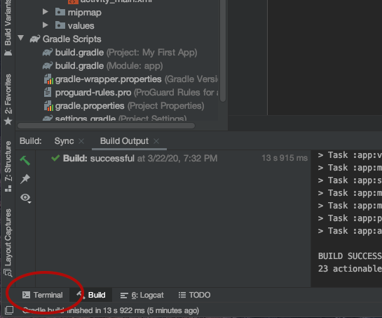

# Wireless Pushing

Do you find it annoying to have to unplug your phone from your robot each time you need to re-push your code? Trust us, so do we. Luckily, there is a solution to our woes: wireless pushing.

Wireless pushing allows us to literally push to our phones over WiFi. To do so, follow these directions.

## Confirm your computer has ADB installed

To proceed with wireless pushing, your computer will need ADB installed. ADB stands for Android Device Bridge, and it allows your computer to interact with Android devices.

First, open up a new terminal window in Android Studio.



Then, type `adb` and hit enter. At the top of the output, you should see something along these lines:

```text
Android Debug Bridge version 1.0.41
Version 29.0.4-5871666
Installed as /usr/local/bin/adb
```

If you don't see something like this, you most likely don't have ADB installed on your computer. You can learn how to install it here: [https://www.xda-developers.com/install-adb-windows-macos-linux/](https://www.xda-developers.com/install-adb-windows-macos-linux/).

## Connect to WiFi Direct network on Computer

Your DS and RC devices communicate to each other via WiFi Direct that we setup earlier. Because your phones are connected to this network, your computer will need to be connected to this network as well. Go ahead and connect to the WiFi Direct network on your Computer.


This will make your computer unable to reach the internet while connected to the WiFi Direct network. You may want another device available for research or for following these directions.


## Enable ADB over TCP/IP

You will need to make sure that ADB can connect to your device over your local network. To do this, follow these directions.

In Android Studio, open the main settings panel:

* On Mac OS, click “Android Studio”, then “Preferences…” \(or simply press the hotkey “⌘,”\).
* On Windows, click “File”, then “Settings…”.

In the settings panel:

1. Expand the “Tools” item
2. Click “External Tools” to open the External Tools list. The list is normally empty.
3. For each of the following tools below, click the \[+\] button, and fill in the provided fields \(leaving all others unchanged\). Once each tool screen is filled-in, click “OK” to save. \(Note: The “Program” field is the same, so the value can be cut and pasted to avoid re-typing.\)
4. Once all tools have been added, click the main settings panel’s “OK” button to save.

These are the tools you need to add:

#### "Enable ADB over TCP/IP"

| Field | Value |
| :--- | :--- |
| Name | Enable ADB over TCP/IP |
| Program | $ModuleSdkPath$/platform-tools/adb |
| Parameters | `tcpip 5555` |

#### "Connect to ADB over WiFi Direct"

| Field | Value |
| :--- | :--- |
| Name | Connect to ADB over WiFi Direct |
| Program | $ModuleSdkPath$/platform-tools/adb |
| Parameters | `connect 192.168.49.1:5555` |

## Connect to your phone

Now that you have added the external tools you need, you will need to connect your phone to your computer \(temporarily\) to enable wireless pushing on the device.

Make sure that a file \(such as an OpMode\) is open and the cursor is in that window.

1. Connect the Robot Controller phone to the computer via USB.
2. Click Tools → External Tools → “Enable ADB over TCP/IP” to enable ADB.
3. Disconnect the USB cable from the Android device and ensure the computer is connected to the WiFi Direct network
4. Ensure the “FTC Robot Controller” app is running on the Android device.
5. Click Tools → External Tools → “Connect to ADB over WiFi Direct” to connect to ADB.

Under devices in Android Studio, you should still see your device, even when you unplug it from your computer. Congratulations, you enabled wireless pushing!

