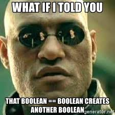

# Booleans

## Why booleans?

Oftentimes in programming, we need a variable that can act like a light switch, and represent one of two values: _`true` or `false`_. Here are some examples of cases in which booleans might be useful:

* Are you at school? **yes / no**
* The light is... **on / off**
* The robot is moving. **true / false**

Java has a primitive data type, `boolean`, that is used for these cases.

## Using booleans

Let's say we have our `LightBulb` class again from earlier. Say we want to be able to store a value that represents if the light is on or off. How would we accomplish this?

```java
boolean isOn = true;
```

As you can see, the variable `isOn` is assigned to the value `true`. If the light was off, then we would reassign `isOn` to be `false`.

### Naming conventions

Typically, it is good practice to name boolean variables as a question. This is to make it easier to determine what this variable is used for and what it represents. For example, _Is the light bulb on?_ should be represented as a variable called `isOn`. This way, it is easier for you and your peers to understand what this variable means.

## Comparison operators

In Java, we can compare values and variables to other values and variables. There are 9 comparison operators in Java that compare a value against another value:

```java
==    // equal to
!=    // not equal to
>     // greater than
<     // less than
<=    // less than or equal to
>=    // less than or equal to
!     // logical not
&&    // logical and
||    // logical or
```

## Logical Expressions

Comparison operators return a boolean. For example, when we compare if a number is greater than another number, we will get a boolean value that represents if that _expression_ is true or false.

```java
boolean isGreaterThan = 98 > 100; //true
```



Java also provides us with 3 special _logical operators_ that are used to compare boolean values to one another. In the following example, we take a look at the three logical operators.

```java
boolean not = !true; //false because not true is false
boolean or  = true || false; //true because at least one of the values is true
boolean and = true && false //false because all of the values must be true
```

### Example

```java
true || false && true
```

A logical expression is between two booleans, compared from left to right. Let's break the expression up using parenthesis:

```java
((true || false) && true)
```

Now, it is more visible that this logical expression is actually 2 expressions in one. The first expression, an _or_ statement, results in true because at least one of the values is true. The second expression, an _and_ statement, results in true because both values are true.

