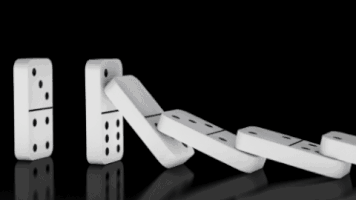
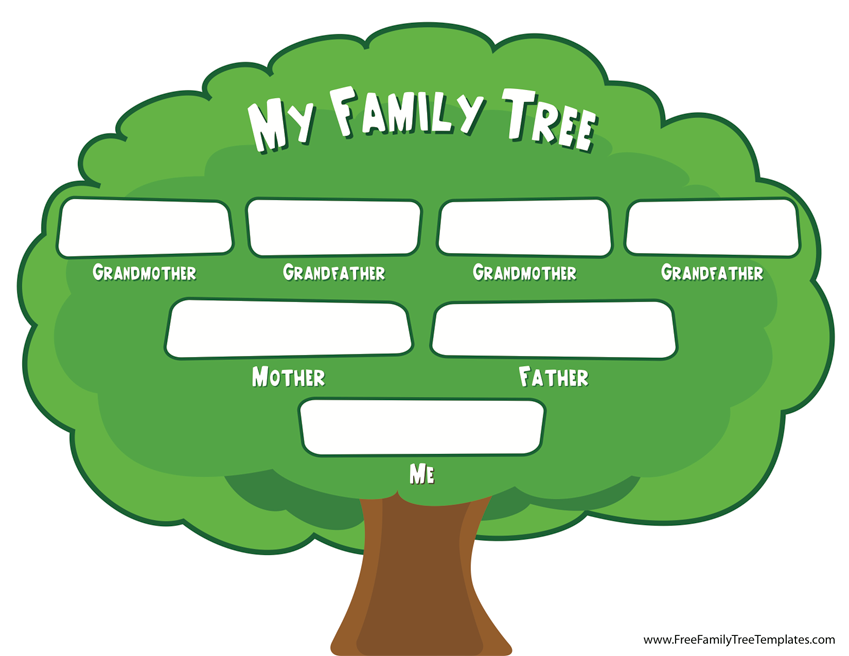

# Recursion

Recursion is defined as "the repeated application of a recursive procedure or definition." But what does that mean, and how does it apply to programming?

## Application to real life

### Dominoes

Recursion is when the **same process occurs repeatedly by itself**. An example of this would be toppling dominoes.



When one domino is knocked over, it knocks over the one in front of it. When that domino is knocked over, it knocks over the one in front of it. Knocking down a domino is the repeated process, and that process repeats itself by knocking down the domino in front of it.

### Family tree

A more abstract application of recursion in real life is a family tree.



Starting at yourself, you have \(presumably\) two biological parents. Both of your parents also have two biological parents, who also have two biological parents, and so on. This is an example of recursion: the "process" is a person having two biological parents, and that process repeats itself because those parents also have two parents.

## Application to programming

### Factorial \(mathematics\)

In mathematics, the factorial \(!\) of a positive integer is the product of all the positive integers less than the original number. For example, 

$$
5! = 5 * 4 * 3 * 2 * 1 = 120
$$

Factorial can also be represented as such:

$$
5! = 5 * 4! = 5 * 4 * 3! = 5 * 4 * 3 * 2! = 5 * 4 * 3 * 2 * 1 = 120
$$

...and in Java:

```java
public int factorial(int n) {
    if(n != 1) return n * factorial(n - 1);
    else return n;
}
/**
 * factorial(3) = 3 * 2 * 1
 *           3 * factorial(2) = 2 * 1
 *                         2 * factorial(1) = 1
 *                                       1
 * 
 * factorial(3) = 3 * 2 * 1 = 3
 */
```

### Robotics

Say you have a robot that you want to move forwards until it sees a wall. You could represent this in code using a while loop:

```java
while(!canSeeWall()) {
    moveForwards();
}
stop();
```

However, you could also write it as a recursive function. 

```java
// public void stop()
// public boolean canSeeWall()

public void moveForwards() {
    if(canSeeWall()) stop();
    else {
        /* code to move forwards once... */
        moveForwards();
    }
}
```

Although in this rather simplistic example it is used as an alternative to while loops, recursion can be very useful when there are multiple conditions you need to confirm before you rerun the  code and for more complex use cases.

