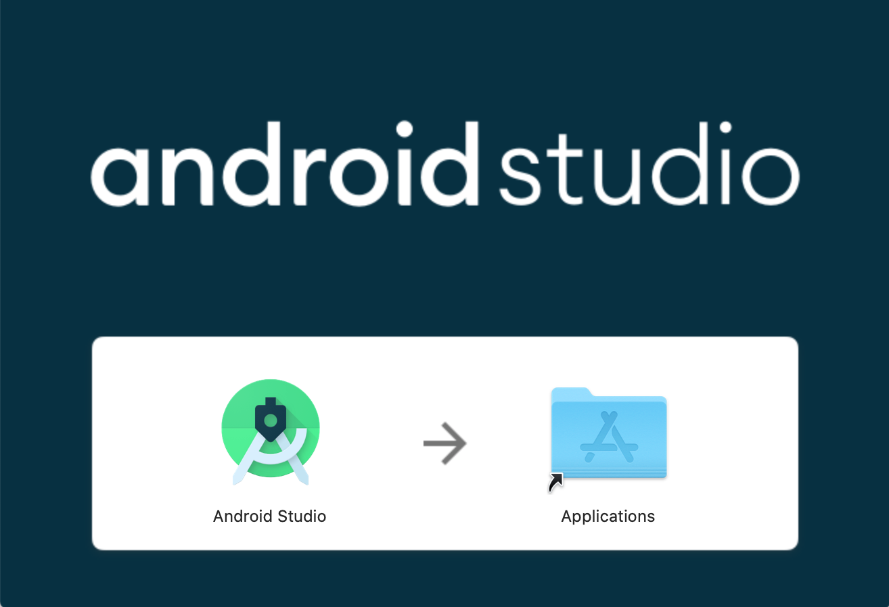

# Android Studio setup


Note that this tutorial gives directions for MacOS users; if you are using a different operating system, you can view the [full FTC Android Studio tutorial here](https://github.com/ftctechnh/ftc_app/wiki/Android-Studio-Tutorial).


## What is Android Studio?

According to the official ["Meet Android Studio"](https://developer.android.com/studio/intro) website,

> Android Studio is the official Integrated Development Environment \(IDE\) for Android app development, based on IntelliJ IDEA.

### Integrated Development Environment

Android Studio is an Integrated Development Environment, or IDE for short, that makes developing for Android a lot more efficient. Without getting too technical, it allows for developers like you and your team to write code for FTC or other Android apps without having to worry much about how your phone and your computer communicate.

## Setting Up Android Studio

### System Requirements

Before we begin, make sure that your computer or laptop is supported by and is able to run Android Studio. You can confirm this by visiting the [Android Studio System Requirements Page](http://developer.android.com/sdk/index.html#Requirements).

One you have confirmed that your system can run Android Studio, we can move onto installing it in your computer.

### Downloading Android Studio

To download Android Studio, visit the [Android Studio Download Page](https://developer.android.com/studio). From there, click the "DOWNLOAD ANDROID STUDIO" button in the center of the screen. Read and agree with the above terms and conditions, then click the blue "DOWNLOAD ANDROID STUDIO" and Android Studio will then be downloaded to your computer.

### Installing Android Studio

Once Android Studio has finished downloading, go ahead and open the DMG file that was downloaded. You should see a window come up. Drag the Android Studio icon into the Applications icon. Android Studio will be moved to your Applications folder.

### Disabling Android Studio Instant Run

FTC recommends that you disable Android Studio Instant Run. They provide directions on how to do so on their main wiki page. [https://github.com/FIRST-Tech-Challenge/SkyStone/wiki/Disabling-Android-Studio-Instant-Run](https://github.com/FIRST-Tech-Challenge/SkyStone/wiki/Disabling-Android-Studio-Instant-Run)

Congratulations! Android Studio should now be successfully installed and set up on your computer.

