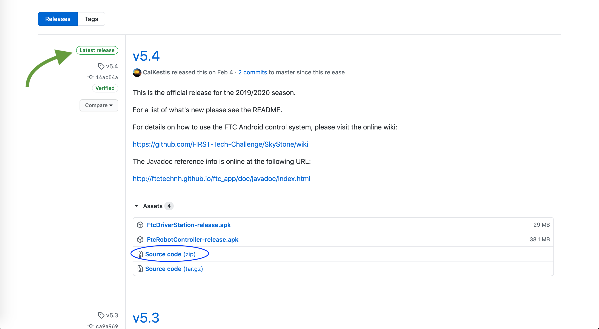

# Using the FTC Project Folder

Each season, FTC provides an Android Studio Project Folder. This folder contains the Android app that you will install on your Robot Controller phone. The folder is available online on [Github](https://github.com).

## Download the folder

For the 2019-2020 Skystone season \(for which this tutorial was written\), the folder is available at [https://github.com/FIRST-Tech-Challenge/SkyStone](https://github.com/FIRST-Tech-Challenge/SkyStone).


This link changes each season. We will be updating the link to the project folder when the next season is released, so stay tuned!


You will need to visit the provided link.

Click on the Releases link on the right side of the screen. From there, find the latest release and click the "Source code \(zip\)" link. This will download the FTC Project Folder to your computer.

## Extracting the folder from the zip



1. Right-click on the SkyStone zip that was downloaded to your computer.
2. Select "Open with" from the popup menu.
3. Choose "Archive Utility". This will extract the SkyStone project folder from the zip.
4. Move the extracted folder to where you want it to be on your computer.



1. Right-click on the SkyStone zip that was downloaded to your computer.
2. Select “Extract All” from the popup menu.
3. Click "Extract" on the window that pops up. Take note of the folder name that was entered in the window.
4. Once the zip has been extracted, double click on the folder that was created.
5. The folder inside of that folder is the "project folder". Move it to where you want it to be on your computer.



## Importing the project to Android Studio

Open up Android Studio. It may ask you to perform additional setup -- follow the instructions on screen. You will then click on "Import project \(Eclipse, ADT, Gradle, etc.\)". From there, select the project folder on your computer. Android Studio will then begin to import the folder. This may take a couple of minutes. You will know it is finished when the loading text at the bottom of the screen goes away.

Once it has finished importing, your Android Studio should look similar to this:


You are now ready to start coding for your robot!


