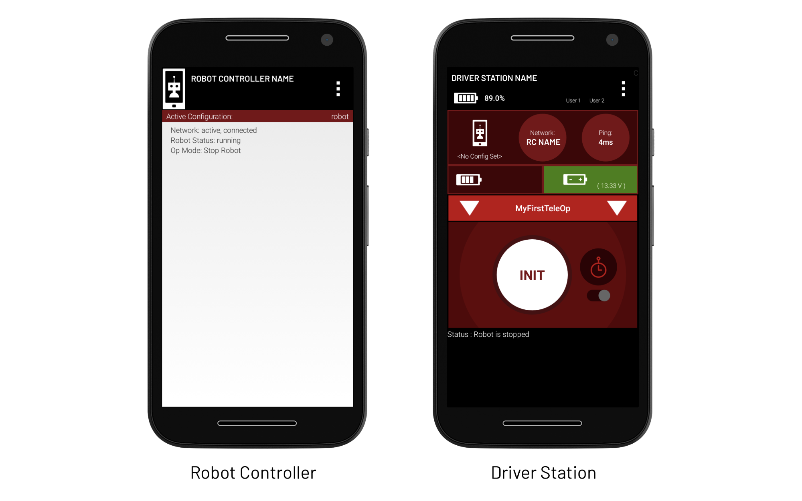

# Phone configuration

You will need both phones for this step.

## Installing apps

On one phone, download the FTC Robot Controller app from the Google Play Store. You will need to rename this phone to `*team number*-RC`, replacing `*team number*` with your team's number. On the other phone, download the FTC Driver Station app from the Google Play Store. You will need to rename this phone to `*team number*-DS`, replacing `*team number*` with your team's number.

Once the apps are installed, they should look like this.

## Renaming phones

To rename your phones, go to Settings → Wifi and then tap on the three dots in the top right corner. Tap on Advanced, and then select Wi-Fi Direct. Tap on the three dots in the top right corner again and click configure. Rename your phone to the new names and set "Wi-Fi Direct Inactivity timeout" to "Never disconnect". Once you have successfully completed these steps, restart your phone.

## Paring the phones

Whenever you are using the phones, they must be paired.

1. On the Driver Station phone, go to Settings → Pairing Method → Wifi Direct
2. Then go to Pair with Robot Controller find the name of your robot controller phone
3. A prompt should appear on the Robot Controller screen prompting you to accept the connection offer
4. The driver station screen should have the name of your robot controller phone in the network circle

